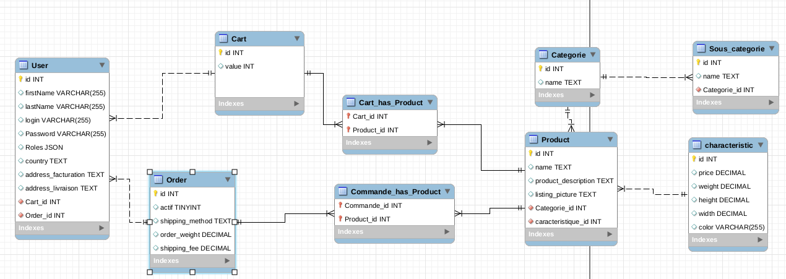

# WEB_ecommerce_2019

### Docker

| Commands                              | Description                                                                   |
|---------------------------------------|-------------------------------------------------------------------------------|
| docker ps -a                          | Liste tous les containers                                                     |
| docker-compose up {containerName}     | Lance un container                                                            |
| docker-compose up -d {containerName}  | Lance le container en tache de fond                                           |
| docker-compose down                   | Stop et supprime tous les containers                                          |
| docker stop $(docker ps -a -q         | Stop tous les containers                                                      |
| docker-compose inspect {containerName}| Inspect docker container                                                      |
| docker exec -it {containerName} bash  | Entrer dans le container avec console bash                                    |
| docker exec -it mariadb mysql -u root | Entrer dans la base sql de mariadb                                            |
 
### MODULES

| Module                              | Description                                                                   |
|---------------------------------------|-------------------------------------------------------------------------------|
| [BACKEND](backend/) | Backend running on Symfony 5.0                                                      |
| [FRONTEND](linkHere/)     | Frontend running on VueJs                                                            |
| [DEVOPS](docker-compose.yml)  | Lance le container en tache de fond                                           |
 
### MARIADB

### SYMFONY

### GITLAB

### TESTS 

8 tranches jambon blanc
rosette 
bacon
chorizo en tranche
viande de grizon ou jambon de bayone
